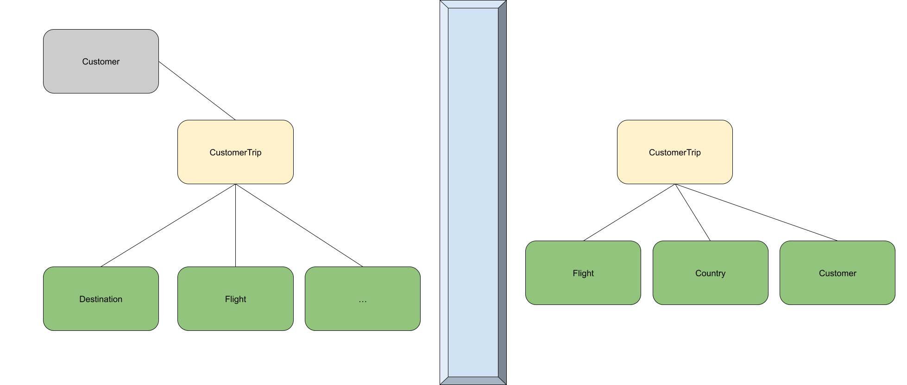

# TYPESCRIPT

- [ ]  Create new folder `<folder_name>`
- [ ]  cd `<folder_name>`
- [ ]  run `npm init`
- [ ]  Create file `index.html`.
- [ ]  Create folder `src`.
- [ ]  Create file `src/index.ts`.
- [ ]  Run `npm i typescript -g` - install typescript global
- [ ]  Run `npm i typescript --save-dev`
- [ ]  run `tsc --init`
- [ ]  Run `npm install webpack webpack-cli --save-dev`
- [ ]  Add `"start": "tsc && webpack"` to scripts.

## Task 2
- [ ] Create new file name `src/user.ts`
- [ ] Add User classes for your end project
- [ ] Create new file name `src/travel.ts`
- [ ] Add Travel interface `export interface Travel{}`
- [ ] Add travels property to User => `travels:Travel[]`
- [ ] DOD `console.log(user)`

;

